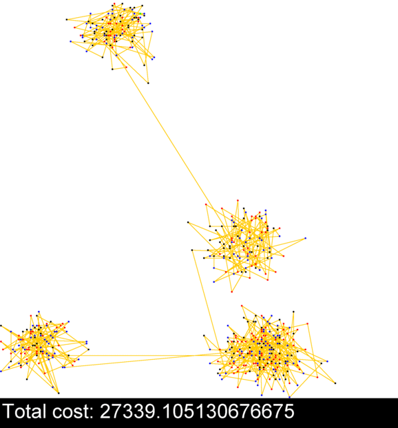

# Delivery Scheduling

## Overview
This project aims to optimize package delivery scheduling using various heuristic algorithms. It provides a menu-driven interface to configure the optimization process and select the desired algorithm.

## How to Run (Developed on IntelliJ IDEA)
1. Clone the repository to your local machine.
2. Open IntelliJ IDEA.
3. Choose "Open" from the IntelliJ IDEA welcome screen and select the cloned project directory.
4. Once the project is open, navigate to the `Main` class.
5. Right-click on the `Main` class and select "Run Main.main()" from the context menu.
6. Follow the on-screen instructions to navigate the menu and configure the optimization process.

## Usage
- Upon running the application, the menu will display the current configuration, which can be modified as desired.
- Options are provided to change configuration parameters or generate packages.
- Select the desired algorithm from the menu to begin the optimization process.
- Follow the on-screen instructions to configure the algorithm-specific parameters and execute the optimization.

## Development Environment
- This project was developed using IntelliJ IDEA.
- Other development environments can also be used, but the provided instructions are tailored to IntelliJ IDEA.

## Structure
- The project consists of multiple classes, each implementing a different heuristic algorithm for package delivery scheduling.
- Test classes are provided for each heuristic, allowing direct configuration changes and execution.

## Problem Formulation and Solution representation​
Our project aims to solve a package delivery optimization problem using various algorithms​
We are tasked with optimizing the delivery of packages in a given area, considering factors such as urgency, fragility, and distance.​

__Minimize Fragile Damage__  
Fragile packages have a chance of damage (X%) for every kilometer traveled (Y),
incurring a cost of Z for each damaged package. The probability of a package
breaking is calculated as follows:

$$P_{\text{damage}} = 1 - (1 - X)^Y$$
Pdamage is calculated for all fragile objects when they arrive at the destination. Then calculate whether the object is damaged or not.

__Minimize Travel Costs__  
Each kilometer traveled incurs a fixed cost C.

__Adhere to Urgent Delivery Constraints__  
Urgent packages incur a penalty for delivery outside the expected time, penalized by
a fixed amount for each minute of delay. The penalty per minute is equal to the fixed
costs C.

### Constraints:
1. You only have one vehicle available.
2. The delivery locations are specified by their coordinates.
3. Routes between all delivery coordinates are available.
4. The driver drives at 60km per hour and takes 0 seconds to deliver the goods.
5. The cost per km is C=0.3.

### Package Types:
1. Fragile packages: Have a chance of damage during transportation.
2. Normal packages: No risk of damage during transportation.
3. Urgent packages: Incur a penalty for delivery outside the expected time.

### Objective Function
Minimize the total cost, considering fragile damage, travel costs, and urgent delivery
penalties.
   
The solution is represented as a sequence of locations (nodes) that the delivery vehicle visits during its route. Each location corresponds to a package delivery point or depot. The order of these locations determines the delivery sequence. This representation was encoded as an array.​

### Hard constraints​
- Time Window​
- Package Priority​
- You only have one vehicle available.

  

## Participants
- Naldo Neves Monteiro Delgado (up201808613)
- Ricardo Antonio Pinto Da Cruz (up202008789)
- Tiago Rocha Silveira Pires (up202008790)****

